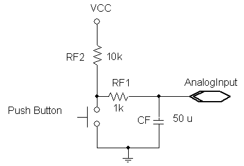
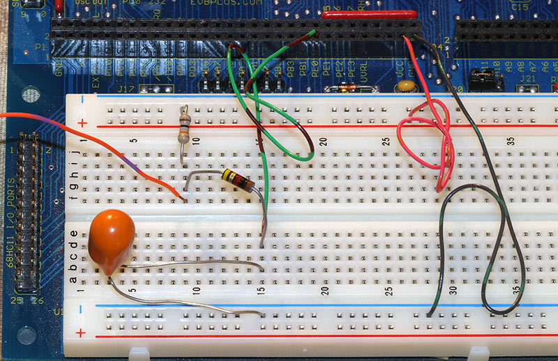

## Overview

In this lab, you will gain experience with the HC11's A/D (analog to 
digital) conversion system. You will take analog input from an RC 
circuit. The capacitor voltage will be connected to the HC11. The 
capacitor discharges while the pushbutton is depressed and
charges while the pushbutton is not depressed.  
You will output the voltage level to the LCD display.

This is a 1-week assignment. You may work alone or with a partner and submit a group report.

## Lab activity

Complete this lab entirely in __assembly language__. 
The circuit above, controlled by a pushbutton (PA0), will provide input to the 
A/D system. The component values may vary somewhat without materially affecting operation of the circuit; RF1 should be small, 
but not so small as to draw too much current when the pushbutton is pressed. The RC time constants RF1&times;CF and (RF1+RF2)&times;CF should be 
between roughly 50 ms and 1.0 s. These are only approximations of the time constants since we are neglecting the input impedance of the A/D system.

Design, code, assemble, link, download, run, and test a program to display the input voltage on
the 2&times;16 character Hitachi display. 
Use the 4-sample mode of the HC11 A/D to perform 4 consecutive conversions of the input 
and then display the average as a number between approximately 0 and 500 (representing 0.00 to 5.00 V, using the method discussed in class) on the display. The display should be 
updated roughly 10 times per second. If it is updated much faster, the less significant digits will fluctuate rapidly and be difficult to read.

On the Fox11, VRH is connected to +5V and VRL is connected to ground, so external connections are not necessary.

Let the capacitor charge for several seconds, then discharge it for several seconds by pressing the button.  Observe the converted output on the display. Note the 
overall minimum and maximum values displayed in your report. Also, include a rough characterization of the fluctuations you observe in your report and 
briefly discuss some potential causes. Then, estimate how close you can keep the displayed voltage to some mid-range value by repeatedly pressing and releasing
the pushbutton.

## Demonstration

You will need to demonstrate your project to the instructor using your Fox11 
system at the beginning of the week 9 lab period. The demonstration determines 50% 
of your lab 6 grade.

## Report (due by the beginning of the week 9 lab)

* Prepare a report in Microsoft Word or PDF.
    * Include source files that you created or modified in your report file.
    * Summarize how much time each group member spent on
        the lab using the following categories: design,
        code, test, debug, report writing, and other.
    * Document your design.
    * Show sample output.
    * Detail any problems you encountered and any questions            
        that remain.
* Create a Zip archive including your report, modified program source files, final listing files (.rst), and executable file (.s19, but not .exe).        
* Follow the report        
    submission requirements.    
* Email this file to the instructor with a subject and message
    body indicating that this is your CS-280 Lab 6 submission.
