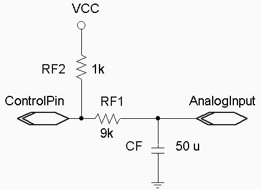

by Dr. Eric A. Durant
 This lab was developed in conjunction with <a href="/~welch/">Dr. 
Henry L Welch</a>.

## Overview

In this lab, you will expand upon your work from <a href="../lab6/">lab 6</a>
to develop a programmable &quot;DC&quot; power supply. Using assembly language
you will develop an application that controls whether the
capacitor in the RC circuit is charging or discharging in an attempt to generate
a &quot;constant&quot; DC value in the range from 0&#8211;5 VDC. This is
not the best way to implement a variable DC supply, but for our purposes it will
introduce you to timing interrupts and the basic concepts of feedback control.

This is a 2-week assignment. You may work alone or with a partner and submit a group report.

## Lab activity

As with lab 6 you should complete this assignment entirely in assembly language.
You will reuse the getkey routine from lab 4.

Wire the circuit as shown to the right. You should recognize that it
is essentially the same as the lab 6 circuit, except that the pushbutton
has been replaced by one of the HC11's digital outputs. Also, to have more agreeable time constants, the resistors have been swapped
(at the cost of a higher minimum voltage -- there are resistors on the Fox11 between your circuit and the HC11 pins that limit the minimum voltage,
especially as RF1 becomes large).

Use fox11_portb (any one of the 8 pins) for your output.  This will allow you to monitor your control pin via a built-in LED.  These pins can be
accessed using the large header just below the HC11 chip on your Fox11.

Modify your program from lab 6 so that in addition to monitoring the
voltage using the A/D system and displaying the results (0&#8211;500, i.e. 0.00
V to 5.00 V) on the 2&times;16 character Microtips/Hitachi display, it also actively controls the
analog voltage on the capacitor. This should work as follows:

1. Accept user input of a desired voltage using up to three keypresses (0&#8211;500). "5" should be interpreted
  as 0.05 V, "50" or "050" should be interpreted as 0.50 V, and "23456" should have characters
  after the 3rd ignored and be interpreted as 2.34 V. You are not required to do special
  error handling for inputs such as "740"&#8212;this is just a voltage 
  that is higher than attainable,
  so your algorithm should naturally seek out the maximum voltage when given such a large value.
2. The display should show the actual voltage (using the averaging and scaling technique from lab 6) on the top line.

   The display should show either the voltage being entered or the target voltage (if the input buffer is empty) on the bottom line.

    The display should be updated about 10 times per second via a dedicated timer interrupt.
3. Develop another ISR that monitors the analog voltage and either sets or 
clears the control pin as follows about 100 times per second:
    * If the voltage is too low output a 1
    * If the voltage is too high output a 0

4. Continue to monitor the keypad (use a polling loop, i.e., the getkey function)
with the following functionality:
    * &quot;0&#8211;9&quot; add a digit to the displayed entry if
        the 3-character input buffer is not full
    * &quot;A&quot; increases the desired output by 0.10 V. (do not go over limit of 9.99)
    * &quot;B&quot; decreases the desired output by 0.10 V. (do not go under limit of 0.00)
    * &quot;E&quot; enter the numeric entry in progress
    * &quot;F&quot; backspace&#8212;Be sure to handle the case 
        where there is no entry in progress.

5. Under all circumstances the program should continue to control the
  voltage; even in the middle of a numeric entry. You may find
  a DMM useful in determining this as well as the
  general accuracy of your voltage supply.

Note: When the program starts up, the target voltage should be 2.50 V.

The component values may vary somewhat without materially affecting 
operation of the circuit; RF2 should be small, but not so small as to draw 
too much current when the control pin goes to ground. The RC time constant 
RF1&times;CF should be between roughly 0.5 and 1.0 s.

### Hints and Caveats

* Setting the timer prescaler select from ASM will not work on our platform since
    there is no convenient way to get code to run in the first 64 cycles after reset.
    You will need to use the 'I' command in the Wytec debugger to set TMSK2 to 0x03
    (make sure that you understand why this is the correct value).  Once you change
    this, your setting will be remembered for the active S19 file, so you do not need to
    do this repeatedly. <strong>However</strong>, some features of the Wytec debugger
    are affected by using a non-default value for the prescaler (TMSK2:PR).  So,
    you should debug your code with TMSK2:PR==0.  You may use either TMSK2:PR==0 (come as 
    close to the timing requirements as possible) or TMSK2:PR==3 for final testing
    and your demonstration.  (An example of a debugging problem with PR!=0 is that
    single-step will actually step several instructions.)
* PE0-PE3 are used for the keypad, so it is recommended that you use PE4 for your analog
    input.  Port E can be used for analog and digital input simultaneously.  Digital reads
    are done via "porte" and analog reads are done via "adrN".
* Set-up the A/D in continuous conversion mode. Then you do not need to 
    poll for A/D completion. Just look in the ADR* registers for 
    the most recent values when you need them.
* Use two separate timer interrupts&#8212;one for the display and one 
    for the digital control output. Be sure to schedule the next 
    interrupt during the ISR. A <strong>very common error</strong> is 
    forgetting to clear the interrupt flag before ending the ISR. This 
    will cause your system to continually handle interrupts and not accept 
    key input, etc.
* Design and test the program in <strong>small chunks</strong>. For example, get the 
    display interrupt working and make sure it shows you the proper 
    voltage (try manually connecting the digital input to logic 0 and 
    logic 1). Then, enable key input and setting of the target voltage.
    Finally, implement and enable the control interrupt. A few different 
    implementation paths are possible; this is only a suggestion.
* Although Wookie does not simulate the A/D system or your 2&times;16 display, it does simulate 
    timer interrupts. So, you can use Wookie with the A/D in continuous 
    conversion mode and the Registers window open for manually modifying 
    the ADR* registers to test part of your program.

## Report (due by Friday of Week 10, 11 P.M.)

Demo: The demo is due by Friday of week 10.  You may demo your program in lab, during office hours, or make an appointment.

Note: No late reports will be accepted after 11 P.M. Wednesday of week 11.

* Prepare a report in Microsoft Word or PDF.
    * Include source files that you created or modified in your report file.
    * Summarize how much time each group member spent on
        the lab using the following categories: design,
        code, test, debug, report writing, and other.
    * Document your design.
    * Discuss how the various parts of your program shared the desired voltage.  Be sure to mention all parts of the program that needed access to this value.
    * Instead of sample output, discuss the behavior of your system (accuracy, speed) for 
        various inputs.
    * Detail any problems you encountered and any questions
        that remain.
* Remember that FAST time entry will be checked with this report -- see the course <a href="../outline.shtml">outline</a> for details.
* Create a Zip archive including your report, source files, final listing files (.rst), and executable file (.s19).
* Follow the report
    submission requirements.
* Email this file to the instructor with a subject and message
    body indicating that this is your CS-280 Lab 7 submission.
