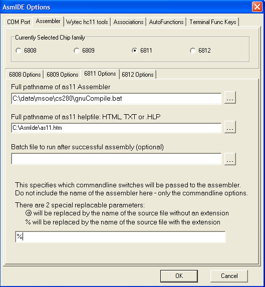

## I. GNU Toolchain for the HC11 (compiler, assembler, linker, etc.)

<a href="http://stephane.carrez.free.fr/EXE/gnu-68hc1x-3.0.1.exe">v3.0.1,
released 15 May 2005 (confirmed still available on 15 October 2019), includes gcc 3.3.5 \[executable installer\]</a>

* Accept default of c:\usr.
* Accept default of &quot;Full installation&quot; (all 4 items).

## II. Local toolchain supplements

This <a href="gnu-68hc1x-3.0-msoe.zip">.zip archive</a> contains local 
customizations for using the latest GNU toolchain for the HC11 with both the
Fox11 and the MSOE briefcase. For more details, see the included
readme-msoe.txt file. Released 6 March 2005.

The accompanying .zip file should be extracted into the root of your C:\ drive.
It is necessary to preserve pathnames.

Several MSOE-related files will be created in C:\usr\..., which was created
in step 1 when you installed the GNU toolchain.

Also, C:\data\msoe\cs280 will be created with some needed files and a 
directory. If you wish, you may move the contents of this cs280 directory to any 
convenient location on your system and then delete the empty cs280 directory (and 
msoe and data). The target directory will be called your "root working 
directory".

It is convenient to be able to quickly open a command prompt to your root 
working directory. Microsoft makes a property menu extension that allows you to 
right-click on a directory in Windows Explorer and then open a command prompt in 
that directory with 1 click. If you wish to install this, see the 
following...

* &quot;Open Command Window Here&quot; for Windows XP \[no longer available online\]

It is recommended that you create directories named &quot;lab1&quot;, &quot;lab2&quot;, etc. 
in your root working directory and store your source code in those 
directories. Some tools, such as WBUG11, do not like spaces in the pathname,
so it is strongly recommended that you avoid them.

After opening a command window, you must run "gccvars" to set up the
environment for that command window so that the GNU tools can be found. If
you open a window in your lab1 directory, you would type "..\gccvars" (without
the quotation marks) and press enter. You can then assemble a file with
a command like "as -o lab1.o lab1.s", run the linker, etc.

## III. Wookie simulator

* Version 1.68 was released on 9 March 2004 and introduces support for
    tracing through GCC3-style objdump disassemblies with intermixed C++ source.
* Version 1.69 was released on 16 December 2004 and introduces support for
    savable window positions via .ini files and additional Registry support of
    application state.
* Version 1.70 was released on 1 January 2005 and introduces support for
    the MGTEK IDE's ASM11 assembler. Also, additional listing format details
    are now shown to the user when opening a listing file to facilitate
    use with other compatible assemblers.
* Version 1.71 was released on 24 March 2005 and fixes several serious bugs
    including the crash on double-click S19 bug and the memory modify offset bug.
    Also, the autoloading of RST/LST files now works correctly.
  * <a href="wookie171.zip">Executable (.zip file, 315&nbsp;kB)</a>
  * <a href="wookie171source.zip">Source code (.zip file, 282&nbsp;kB)</a>
  * Recommended install location: C:\Program Files
  * Recommendation: Right-drag the executable to your Start menu for easy access.
  * <a href="wookieBugs.html">Bug list</a>

## IV. \[Fox11 only - use in CS-280 and CS-384\] AsmIDE with WBUG11 downloader

* Insert the CD that shipped with your Fox11 board.
* Run setup.bat from the CD. This will create a c:\Ep2IDE and install various files and programs in it.
* Make a shortcut to C:\Ep2IDE\AsmIDE.exe from your start menu.

## V. \[Briefcase only - Historical interest only, no longer used in MSOE classes\] WinBug11 downloader

* Version 1.36 was released on 11 March 2004. It properly handles S0 records
    and fixes a few obscure bugs.
* Version 1.37 was released on 16 March 2004. It properly handles S19 files
    larger than 16 kB without issuing an "Invalid S19 file" error. Also, the
    verify function was improved in response to the S19 fixes from v1.36.
  * <a href="winbug137.zip">Executable, help, and talkers (.zip
    file, 90&nbsp;kB)</a>
  * <a href="winbug137source.zip">Source code (.zip file, 165&nbsp;kB)</a>
  * Recommended install location: C:\Program Files\WinBug11
  * Recommendation: Right-drag the executable to your Start menu for easy access.
  * Update: 15 March 2004: If you receive an error that one of the MFC dynamic
    link libraries (MFC71.DLL or MSVCR71.DLL) could not be found when 
    attempting to run WinBug11, place the files contained in
    MFC71.zip (680&nbsp;kB) in the directory
    with the WinBug11 executable. You will not receive this error if you
    have upgraded to Visual Studio .NET 2003 or, perhaps, have applied
    certain service packs or Microsoft framework updates.
  * Update: 18 March 2004: Some people also need msvcp71.dll (499,712 B; CRC-32 5a3b11d4).
  * <a href="winbug11Bugs.html">Bug list</a>

## VI. Automating the build from AsmIDE

This
was contributed by Scott Chamberlain.

<a href="gnuAssemble.bat">This batch script</a> will do a full assemble of a single file from within AsmIDE and have the new files
in the same directory as the original file's directory.

To set this up, do the following. Inside AsmIDE go to
options/assembler, under pathname of as11 assembler put the batch script
I wrote. In the parameters box at the bottom it will need just a %. The picture to the right will help explain.
