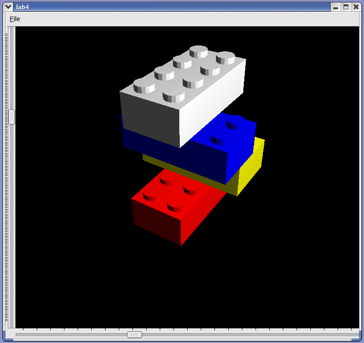

You may work in pairs or alone on this lab assignment.

The <a href="lego.zip">LEGO utility class from last week</a> has proper surface normals
and material properties set so that lighting may be used. Also, glFrontFace
is used so that culling may be enabled if desired.

## Required

Begin with last week's application and...

* Add ambient light.
* Add a directional or positional light.
* Set-up perspective viewing with the proper aspect ratio.
* Make use of the depth buffer (from last week).
* Augment the file format to allow blocks to be rotated 90 degrees
    about the y-axis and add support for this feature to your program.
* Create a data file representing at least 10 bricks in various colors
    in a configuration of your own design. Several (or all) of the bricks should
    be "snapped together". Some of the bricks should be rotated. Be sure
    to include your data file and a screen image with your report.

## Required / Optional

At least two (four if working in a group of two) of the following features are required.  In your report, be
sure to clearly state which features you implemented.  I welcome suggestions of additional features to
be added to this list.

* Provide an interface for changing light parameters (position, etc.)
  * Allow the user to select whether the light position is bound to the viewer, the scene, or the model
* Allow the user to change the viewing distance
* Allow the user to zoom in/out (note: this is different than the above option)
* Add other brick sizes besides 4&times;2&times;1
* Support culling
* Use display lists for efficiency
* Use vertex lists for efficiency

Feel free to add other features. Check with the instructor if you have any questions.

## References

You may find the <a href="https://www.opengl.org/archives/resources/faq/">OpenGL FAQs for Developers</a> helpful.

The <a href="https://www.opengl.org/archives/resources/faq/technical/lights.htm">OpenGL Technical 
FAQ's section on lights</a> is an excellent supplement to
your textbook and provides suggestions on some of the above features.

## Demonstration

__Demonstrate__ your working program
to the professor (25% of grade) during or before the week 5 lab.

## Group Report (due by 11 P.M. Friday of week 5)

Your lab report need not be self-contained. This means that it is
__not__ necessary to restate the entire specification in your 
report.

* Prepare your report in PDF, Word, or XML (cctHW.xsl, or other approved XSL) format
* Include...
  * a summary of what you did for this lab;
  * details of any problems you encountered;
  * suggestions for how the lab could be improved;
  * things you could not figure out how to do;
  * a list of extra features that you implemented, if any;
  * A summary (dates, times, durations, and interruption
      durations) of your activity log indicating how much time you spent
      on the assignment. Use the following categories:
    * Design
    * Coding
    * Debug (before you think it's working)
    * Test (after you think it's working)
    * Documentation
    * Other
  * Documented source code
  * Code documentation with appropriate diagrams as produced by doxygen,
      javadoc, or a similar in-source documentation tool.
* Follow the report submission requirements.
* Email this file to the instructor with a subject and message
    body indicating that this is your CS-421 Lab 4 submission.
