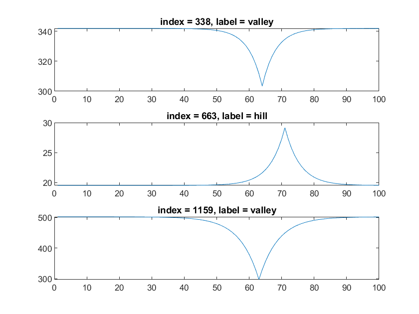

# CS4981 Deep Learning In Signal Processing

# Week 2 Lab

The Week 2 Lab has two options, depending on your previous experience with machine learning.

1. The Signal Representation option is recommended for those with some machine learning experience, or those who are very comfortable working in MATLAB and can adapt the tutorial examples to different data. MATLAB is optional here.

2. The Transfer Learning in MATLAB option is recommended for those new to machine learning. MATLAB is required here.

All data files (hillvalley\_\*) are posted under the lab assignment in Canvas.

Acnkowledgement: This lab was originally developed by Dr. Sheila Ross.

## Option 1: Signal Representation

### Problem Description
In this lab, you are to classify 1-dimensional signals as representing a &ldquo;hill&rdquo; or a &ldquo;valley&rdquo;.

We will be using the [UCI Machine Learning Repository: Hill-Valley Data Set](https://archive.ics.uci.edu/ml/datasets/Hill-Valley), and I will provide several versions of this data to assist you in the various approaches you may choose to classify the signals.

The dataset consists of 1212 signals of &ldquo;clean&rdquo; data, in which each signal is smooth and clearly shows a hill or valley. Each signal consists of 100 points.

Examples of the signals when plotted: 

For additional challenge, the dataset also provides 1212 signals of &ldquo;noisy&rdquo; data, where the hill or valley can still be discerned by the human eye, but the classification is more difficult.

You may use the original text files from the UCI site, the MATLAB files I have created containing the signals and labels in various forms, or the image files I have created containing plots of the signals. A detailed description of the available formats will be included at the end of this document. You may use any computational environment you wish; MATLAB is not required.

### Assignment
Use any automated method to classify the signals. Your method may include machine learning, but it is not required. For example, you could:
* Come up with a heuristic calculation based on the data (for example, I might be tempted to use numerical differentiation to classify the signals, but that is hard to interpret with the noisy data)
* Use shallow or deep neural networks to classify the 1-D signals, either in the time domain, or convert them to the frequency domain before classification[^1]
* Use deep networks to classify plot images (2-D versions of the signals)

You will not be graded on how successful you are in classifying the signals. You will be graded on your description of your approach to the problem and the analysis of the results you obtained, regardless of whether they are accurate or inaccurate. This problem is meant to get you thinking about data representation and the variety of approaches one can take for classification of signals. You do not need to try all the approaches listed above; pick an approach and do your best.

### Deliverables
Provide a report, in the form of a document or a video, describing your approach, your results, and (if applicable) difficulties you encountered in accurately classifying the signals. If writing a report, it should be no more than 4 pages. If recording a video, it should be no more than 10 minutes.

Submit your file or a link to your file/video via Canvas.

### Available Data Files
In addition to the original text files from the UCI site, I have saved the signals in a variety of formats, to facilitate different approaches to the classification problem.

* MATLAB file hillvalley.mat contains the signals in both the time domain and frequency domain formats. The noisy signals have \_n in the variable names. These representations are the most convenient for heuristic calculations and shallow neural networks. The &ldquo;target&rdquo; variables contain the signal labels in the format needed by MATLAB&rsquo;s shallow neural networks, and the signals are arranged so that each column of the matrix is an individual signal.
* MATLAB files hillvalley_cells.mat and hillvalley_n_cells.mat contain the signals in cell array form. The data in this file would be compatible with the approach taken in the MATLAB tutorials on sequence-to-label classification using the Japanese Vowels example dataset: [Create Simple Sequence Classification Network Using Deep Network Designer - MATLAB & Simulink (mathworks.com)](https://www.mathworks.com/help/deeplearning/gs/create-simple-sequence-classification-network.html) Note the separate cell arrays for training and validation, which were taken from the training/testing breakdown given in the original dataset. I have created both time domain and frequency domain representations in these files for you to use in your experiments.
* The zip files hillvalley_plots and hillvalley_noisy_plots contain plots of the signals with the y axis starting at zero and ending at 1.2 times the max value, similar to a standard MATLAB plot. The signal is positioned in roughly the same place in the plot for each of these images. The files hillvalley_zoomed_in and hillvalley_noisy_zoomed_in plot the signals in a more &ldquo;zoomed-in&rdquo; fashion. These images could be classified with a deep network with convolutional layers.

[^1]: The [fft() function in MATLAB](https://www.mathworks.com/help/matlab/ref/fft.html) will provide the coefficients for the frequency components of the signal, as a vector going from the lowest to highest frequency components. These coefficients are produced as complex numbers. It is common to represent the coefficients using a magnitude value and phase value, specifying the amplitude and phase of the sinusoidal components. Thus, the single 1-D signal sequence in the time domain becomes two real-valued sequences in the frequency domain. The function abs() provides the magnitude of a complex number and the function angle() provides the phase.

## Option 2: Transfer Learning in MATLAB

### Problem Description
In this lab, you are to classify images of 1-dimensional signals as representing a &ldquo;hill&rdquo; or a &ldquo;valley&rdquo;.

The data originates from the [UCI Machine Learning Repository: Hill-Valley Data Set](https://archive.ics.uci.edu/ml/datasets/Hill-Valley). The dataset consists of 1212 signals of &ldquo;clean&rdquo; data, in which each signal is smooth and clearly shows a hill or valley. For additional challenge, the dataset also provides 1212 signals of &ldquo;noisy&rdquo; data, where the hill or valley can still be discerned by the human eye, but the classification is more difficult.

While it is possible to classify these signals using traditional signal processing techniques and very simple neural networks, in this lab we will practice using the Deep Learning Network Designer to classify plots of these signals as being &ldquo;hill&rdquo; or &ldquo;valley&rdquo;.

The zip files hillvalley_plots and hillvalley_noisy_plots contain plots of the signals with the y axis starting at zero and ending at 1.2 times the max value, similar to a standard MATLAB plot. The signal is positioned in roughly the same place in the plot for each of these images. The files hillvalley_zoomed_in and hillvalley_noisy_zoomed_in plot the signals in a more &ldquo;zoomed-in&rdquo; fashion. You may use either the plot or &ldquo;zoomed-in&rdquo; versions in your analysis; whichever works better for you. Start by classifying the &ldquo;clean&rdquo; data, which is an easier problem, then move on to the &ldquo;noisy&rdquo; data.

### Assignment
Follow the tutorial described in [Transfer Learning with Deep Network Designer - MATLAB & Simulink (mathworks.com)](https://www.mathworks.com/help/deeplearning/ug/transfer-learning-with-deep-network-designer.html), which describes how to use the SqueezeNet pretrained neural network to classify images. However, instead of using SqueezeNet and the object image files, use AlexNet (which is simpler) and your hill/valley image files. I highly recommend running this on ROSIE as you did in the Week 1 Lab.

You will be starting with a neural network which has many layers. The layers near the top of the diagram in Deep Network Designer have identified very basic features that real-life images possess but random noise does not (like lines and patches of colors), while the lower layers towards the end have taken those basic features and decided how to put them together to tell one object from another. (For an introduction to deep learning/image feature learning, I recommend [Andrew Ng: "Deep Learning, Self-Taught Learning and Unsupervised Feature Learning" - YouTube](https://www.youtube.com/watch?v=pfFyZY1RPZU) which is an older video but really captures the excitement of early work in this area.)

As you follow along with the tutorial, you will see that your job is to remove the layers toward the end which make the &ldquo;final decision&rdquo; about what object is in an image, and replace it with a &ldquo;blank slate&rdquo; which you will train to take those important features for discerning images and classify the images into the categories that you care about: hills and valleys.

You may need to change the training options in order to get the training to finish; I changed the solver to &ldquo;adam&rdquo; and had better results.

If you are able to train the network to be over 90% correct in its predictions, then try to make things a little more challenging:

1. Use the noisy dataset instead of the clean dataset and see how the network does
2. Delete additional layers of AlexNet further up the chain, so you are starting with more basic features to discern between images. Fewer layers = smaller network, shorter training. I was able to delete layers between the final convolutional layer and final fully connected layer and still achieved good results.

**Before you exit the Deep Network Designer, be sure to do the following:**
* Capture the training results window to include in your report
* Staying in the training results window, click the Export button to export the trained network to the workspace
* Finally, click the Analyze button and capture the window which describes the layers in detail, to include in your report.

The images can be run through the final trained network in the workspace, to see which images the network classified incorrectly in the end. The default name for the trained network is trainedNetwork_1. To run images through the trained network to see how they were classified, the easiest method is to turn them into a datastore. Assuming the current working directory is the directory which has the hill and valley folders, create a basic image datastore as follows:

    ds = datastore(".", "LabelSource","foldernames", "IncludeSubfolders",true);

Then create an &ldquo;augmented datastore&rdquo; which holds images scaled to fit the AlexNet network (227&times;227):

    dsa = augmentedImageDatastore([227 227 3], ds);
Pass the images through the trained network to obtain the classification results:

    result = classify(trainedNetwork_1, dsa);
Grab the true categories of each of the images from inside the datastore:

    truth = ds.Labels;
Find the images where the truth doesn&rsquo;t match the result:

    wrong = find(truth~=result)
These are the image numbers that &ldquo;tricked&rdquo; the network. Do you see anything that might make these images harder to classify?

### Deliverables
Provide a report, including the screen captures listed in the previous section, and a paragraph or two describing what you did and what you discovered in your results. If the network misclassified any of the images, include a few or describe what the tricky images looked like.

Submit your file or a link to your file/video via Canvas.
