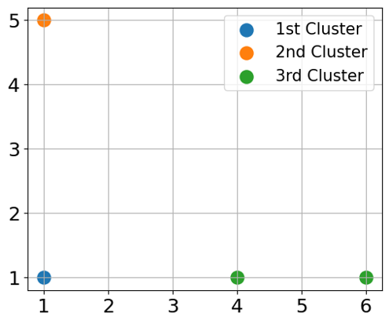

## Spring, 2024 Presentation Schedule

* Week 14
  * Thursday
    1. SVD++, 3 students
    1. Hierarchical Clustering, 2 students
       * Is agglomerative clustering an O(n²) algorithm in the general case? If not, name a case in which it can run in O(n²) time.
       * During a run of agglomerative clustering, there are three clusters in a two-dimensional space. The first includes the point (1, 1). The second includes the point (1, 5). The third includes two points: (4, 1) and (6, 1). Using complete linkage and Manhattan distance, which two clusters should be merged next? 
    1. K-Means, 2 students
       * What is the first step of K-Means?
       * What is one downside to the elbow method?
    1. Multi-layer Perceptron, 2 students
       * What is the role of activation functions in an MLP?
       * How does backpropagation help in training an MLP?
  * Friday
    1. Random Forests, 2 students
       * What are some similarities or differences between the feature selection of Decision trees or Random Forests?
       * How does bagging contribute to the robustness and accuracy of a random forest model?
    1. DBSCAN, 2 students
       * Under what conditions is a point labeled as noise?
       * What are the two hyperparameters for DBSCAN?
* Week 15
  * Monday
    1. ARIMA, 1 student
       * What are the 3 parts of the ARIMA model and how do they relate to the input timeseries?
       * True or False: ARIMA is a type of regression?
    1. Isolation Forest, 2 students
  * Thursday
    1. NEAT, 3 students
       * What advantage does an evolutionary algorithm like NEAT have over more traditional algorithms?
       * In what environments is it most successful?
       * What are the 3 steps of the training loop for evolutionary algorithms?
    1. Gradient-Boosted Trees, 1 student
       * What is the initial guess used by a gradient boosted decision tree?
       * What is one drawback of a gradient boosted decision tree?
    1. UMAP, 2 students
    1. Naive Bayes, 1 student
  * Friday: Review Day, No Presentations

Presentations should last 16–18 minutes. That will leave at least 4 minutes for questions and changeover.

Each team should propose at least 2 questions for understanding. The professor will include several of these on the final exam, making up roughly 15% of the final exam weight. Questions should be short answer or include a brief calculation or algorithm step. Please include your questions on your slides that you submit for review, and in your presentation.

## Overview

Your project will take the final form of a 16–18-minute presentation on a machine learning algorithm. The purpose of this project, and subsequent presentation, is to add more breadth to this class by discussing different machine learning techniques. It is therefore your responsibility to learn how a single algorithm works, apply the algorithm to a set of data, and then present the method and the application to the class as the teacher.

Course and project outcomes:
* Understand the basic process of machine learning.
* Understand the concepts of learning theory, i.e., what is learnable, bias, variance, overfitting.
* Understand the concepts and application of supervised learning.
* Analyze and implement basic machine learning algorithms.
* Understand the role of optimization in machine learning.
* The ability to assess the quality of predictions and inferences.
* The ability to apply methods to real world data sets.

## Project Proposal

Undergraduate students will work in teams of 2 or 3. Graduate students will work in teams of 2. Due to the additional expectations for graduate students (see below), I do not recommend mixed teams.

Your team must submit a brief project proposal. Duplicate topics between groups will not be allowed. Therefore, your proposal must identify your top 3 preferred methods, the example data set(s) you will use for each model, and the first ten records of the dataset(s) to demonstrate that you are able to access and load the data.

## Data Sets

While you are not limited to these choices, some data sets are available from the UC Irvine Machine Learning Repository or Kaggle:
* https://archive.ics.uci.edu/
* https://www.kaggle.com/

## Presentation Requirements

Your will create and deliver a PowerPoint presentation on your chosen model / algorithm. In your presentation you should identify and explain the following:
* The type of machine learning problem solved (e.g., regression or classification)
* The model used by the method
* The cost function that is optimized in order to fit the model (where appropriate)
* How the model is fit (e.g., describe the algorithm)
* How a fitted model is used to make predictions
* An example of applying the model to the chosen example data set, including an evaluation of the predictions using an appropriate metric
* Discussion of any advantages or disadvantages of the model / algorithm such as an analysis of the time or space complexity for model fitting and prediction

## Project Milestones

* 10 points: Team and Topic Choices (Only 1 team member should submit in Canvas): End of week 8
* 50 points: Draft of Presentation Slides: End of week 13
* 100 points: Give Presentation: Throughout weeks 14 and 15
* 10 points: Submit Final Slides, Code, etc.: End of week 15

## Grading

This assignment will carry 15% of your overall class grade.

## Example Models / Algorithms
* Clustering
  * K-Means
  * Affinity Propagation
  * Spectral Clustering
  * DBSCAN
  * Gaussian Mixture Models
  * Hierarchical Clustering
* Classification / Regression
  * Naïve Bayes
  * Random Forests
  * Gradient-Boosted Trees
  * Transductive SVMs / Semi-Supervised Support Vector Machines (S3VMs)
  * Multi-layer perceptron (type of artificial neural network, should discuss backpropagation and activation functions)
  * Large margin nearest neighbor
* Recommendation Systems
  * Collaborative Filtering
  * Matrix factorization methods
  * Alternating Least Squares
* Dimensionality Reduction
  * Non-negative matrix factorization (NMF)
  * tSNE
  * UMAP
  * Metric learning (e.g., neighborhood component analysis)
* Anomaly Detection
  * Random sample consensus (RANSAC)
  * Isolation forests
  * Robust Random Cut Forest (RRCF)

## Additional Expectations for Graduate Students

In your proposal, please choose 2 of the following additional tasks that you will complete and incorporate into your final presentation. Your presentation should clearly label these sections.

* Algorithm Implementation from Scratch—depending on the complexity, this may be a full implementation or a simplified version that has some well documented assumptions.
* Performance Comparison—compare 2 or more implementations (possibly including your own, ideally including at least 1 popular library implementation). Ideally on Rosie, look at runtime, memory usage, CPU/GPU usage, etc., perhaps varying data set size, dimensionality, etc. Runtime is somewhat straightforward (if you're not on a busy, shared system), but the others can be challenging to monitor with the basic tools. It is okay to focus on runtime, but you are encouraged to investigate other metrics. Document key hardware and software used (CPU, GPU, memory for each, GPU driver version, key container/libraries, etc.).
  * In TensorFlow you might use the [TensorBoard profiler](https://www.tensorflow.org/tensorboard/tensorboard_profiling_keras).
  * In PyTorch, you might use the [PyTorch profiler](https://pytorch.org/tutorials/recipes/recipes/profiler_recipe.html).
  * More general tools that are useful but fairly limited are [top](https://www.howtogeek.com/668986/how-to-use-the-linux-top-command-and-understand-its-output/) and [nvidia-smi](https://developer.nvidia.com/system-management-interface).
  * A powerful tool that may have a significant learning curve is [NVIDIA Nsight Systems](https://developer.nvidia.com/nsight-systems).
  * On Windows, [Process Explorer](https://learn.microsoft.com/en-us/sysinternals/downloads/process-explorer) lets you monitor per-process CPU time and CPU cycles, among other things.
  * On Linux, you might look at [atop](https://www.digitalocean.com/community/tutorials/atop-command-in-linux), [perf](https://perf.wiki.kernel.org/index.php/Tutorial), and [Sysstat's sar](https://github.com/sysstat/sysstat?tab=readme-ov-file#sysstat---system-performance-tools-for-the-linux-operating-system) for similar statistics.

* Hyperparameter Tuning and Optimization—Perform a grid search, random search, Bayesian optimization or other optimization and discuss your results.
* Theoretical Deep Dive—Consider the algorithm's convergence properties, how empirical performance differs from theoretical performance, sensitivity to hyperparameters, etc. You should consider test runs to see if they are consistent with theory. Please cite your source(s); I am asking you to learn and discuss the theory at a deeper level, not produce it.
