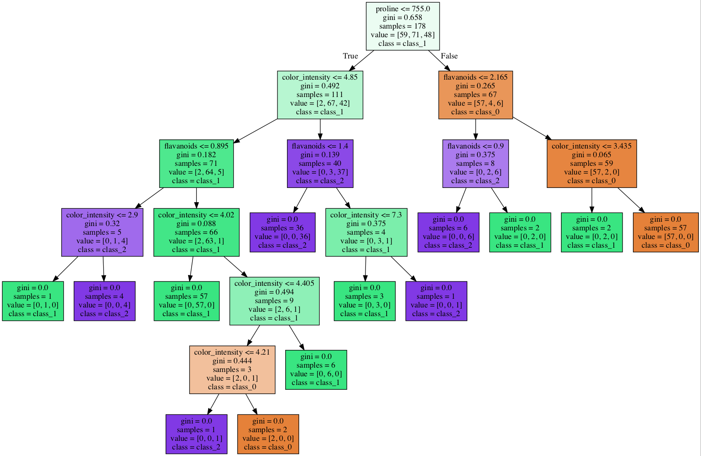
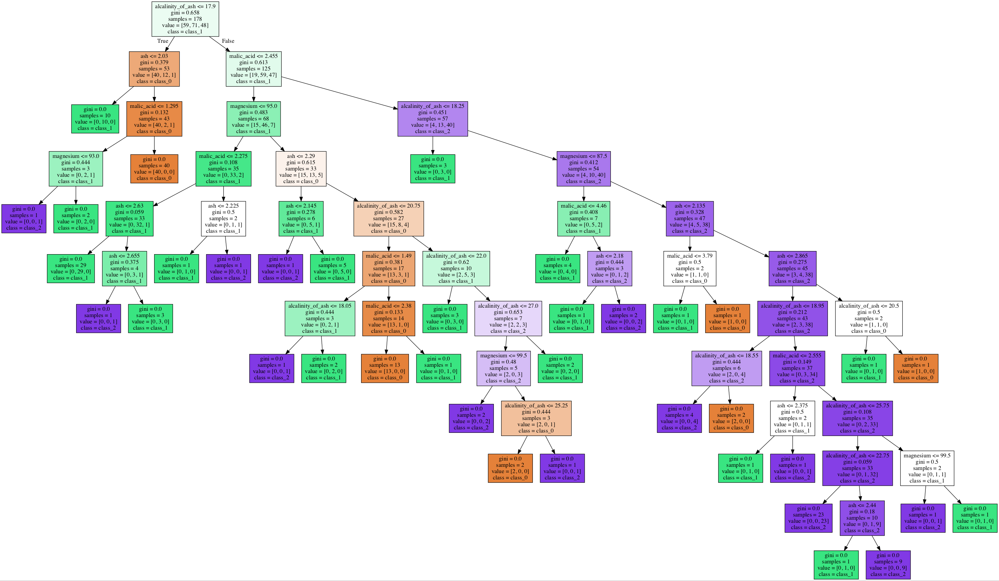

You may complete the following entirely in a Jupyter notebook. Ensure that the notebook has your name on it. Save the notebook as a PDF and submit the PDF through Canvas.

## Problem 1: Logistic Regression Decision Boundaries

Let's practice plotting the linear decision boundary learned by a logistic regression model. Assume you are given the following fitted model:

$P(y = 1 &vert; \vec{x}) = \frac{1}{1+e^{-(32 - 9.4x_1 + 8x_2)}}$

First, we want to pull out the part of the equation corresponding to the plane and set it equal to 0:

$32 - 9.4x_1 + 8x_2 = 0$

Next, if we re-arrange the equation, we obtain:

$-8x_2 = 32 - 9.4x_1$

which simplifies to:

$x_2 = -4 + 1.175x_1$

We can now use NumPy's \texttt{linspace} function to generate the $x_1$ values and then plug them into the line's equation to generate the values for $x_2$. (For this case, a line as opposed to a more general curve, using a NumPy \texttt{array} of 2 elements will also work.) Lastly, we can plot the line defined by the two arrays of $x_1$ and $x_2$ values.

Your turn! Find the equation of the line/plane for each fitted model below and plot the line/plane.

- $P(y = 1 &vert; x) = \frac{1}{1+e^{-(-20.96-123.08x_1+40.46x_2)}}$
- $P(y = 1 &vert; x) = \frac{1}{1+e^{-(259.55-27.15x_1-30.49x_2)}}$
- $P(y = 1 &vert; x) = \frac{1}{1+e^{-(-26.7-284.7x_1+284.9x_2-64.6x_3)}}$

## Problem 2: Log-Likelihood

A logistic regression model is trained by finding weights which optimize the logistic likelihood function:

$L = \prod_{i=1}^N P(y^{(i)} = 1 &vert; x^{(i)})^{y^{(i)}} (1 - P(y^{(i)} = 1 &vert; x^{(i)}))^{1 - y^{(i)}}$

where $x^{(i)}$ represents the feature vector of the $i^{th}$ sample and $y^{(i)}$ represents the label of the $i^{th}$ sample.

Logistic regression computes the probability that each sample $x^{(i)}$ belongs to class 1. Formally, the logistic regression model is referred to as $P(y^{(i)} = 1 &vert; x^{(i)})$. Since logistic regression only assumes two possible outcomes, the probability that the sample is not in class 1 is given by $1 - P(y^{(i)} = 1 &vert; x^{(i)})$. Depending on which class (designated 0 or 1) the sample is in, the exponent of one term will be 1 and the other will be 0. So only one term is used per sample in the calculation of the likelihood.

For example, assume we are trying to distinguish between ``setosa`` and ``non-setosa`` samples. If a sample $i=5$ has relatively small petal lengths and widths, there is a high probability (e.g., 99\%) that the sample belongs to the ``setosa`` class. We would write this as $P(y^{(5)} = setosa &vert; x^{(5)}) = 0.99$. Assume that the sample genuinely does belong to the ``setosa`` species so $y^{(5)} = 1$. Since $1 - y^{(5)} = 1 - 1 = 0$, the $1 - P(y^{(5)} = 1 &vert; x^{(5)})$ is reduced to 1. We then calculate the rest to get the likelihood for that sample:

$L_i = P(y^{(i)} = 1 &vert; x^{(i)})^{y^{(i)}} (1 - P(y^{(i)} = 1 &vert; x^{(i)}))^{1 - y^{(i)}}$

$L_5 = 0.99^1 (1 - 0.99)^{1 - 1}$

$L_5 = 0.99$

Now, let's look at the case where the species of sample $7$'s species is not setosa but the model predicts that it is. Assume the model gives us a probability of 75\% of being in setosa: $P(y^{(7)} = setosa &vert; x^{(7)}) = 0.75$. The true class of the sample is 0 so $y^{(7)} = 0$.

$L_i = P(y^{(i)} = 1 &vert; x^{(i)})^{y^{(i)}} (1 - P(y^{(i)} = 1 &vert; x^{(i)}))^{1 - y^{(i)}}$

$L_7 = 0.75^0 (1 - 0.75)^{1 - 0}$

$L_7 = 1 - 0.75$

$L_7 = 0.25$

Calculate the likelihood for each sample and overall when all of the model's estimated probabilities are consistent with the true class.

| $P(y = 1)$ | y | Per-Sample Likelihood |
| :--: | :--: | :--: |
| 0.99 | 1 |  |
| 0.99 | 1 |  |
| 0.01 | 0 |  |
| 0.01 | 0 |  |
| 0.99 | 1 |  |

- Overall likelihood:

Calculate the likelihood for each sample and overall when none of the model's estimated probabilities are consistent with the true class.

| $P(y = 1)$ | y | Per-Sample Likelihood |
| :--: | :--: | :--: |
| 0.01 | 1 |  |
| 0.01 | 1 |  |
| 0.99 | 0 |  |
| 0.99 | 0 |  |
| 0.01 | 1 |  |

- Overall likelihood:

Calculate the likelihood for each sample and overall when none of the model's estimated probabilities are consistent with the true class.

| $P(y = 1)$ | y | Per-Sample Likelihood |
| :--: | :--: | :--: |
| 0.75 | 1 |  |
| 0.99 | 1 |  |
| 0.25 | 0 |  |
| 0.01 | 0 |  |
| 0.99 | 1 |  |

- Overall likelihood:

What is the best possible likelihood value? The worst possible?

## Problem 3: Interpretability of Logistic Regression

Linear models such as linear regression and logistic regression are considered interpretable machine learning models.

1. In linear regression, a continuous outcome is predicted as a weighted sum of the feature inputs:

    $y = b + \beta_1x_1 + \beta_2x_2 + \cdots + \beta_mx_m$

    The weights $\beta_1$, $\beta_2$, ... , $\beta_m$ help us understand the contribution of each feature to the predicted outcome. For instance, if we keep all features constant and we increase $x_1$ by 1 unit, how does $y$ change?

1. Your answer to the last question is the way we interpret the weights in linear regression. In logistic regression, the interpretability of the weights differ. A logistic regression model predicts the probability that an instance belongs to class 1 (assuming here a binary classification, $y \in \{0, 1\}$):

    $P(y=1&vert;x) = \frac{1}{1+e^{-( b + \beta_1x_1 + \beta_2x_2 + \cdots + \beta_mx_m)}} \;\;\; (1)$

    To interpret the weights correctly for a logistic model, we need to reformulate the above equation.

      1. Use (1) to express the following ratio in terms of features and their weights:

         $$\frac{P(y=1&vert;x)}{P(y=0&vert;x)}$$

         The ratio (probability of $y=1$ divided by probability of $y=0$) is called the __odds__. For example, if you have odds of 2, it means that the probability for $y=1$ is twice as high as the probability for $y=0$.

      1. If we keep all features constant and we increase $x_1$ by 1 unit, how do the __odds__ change?

      1. Assume that the features are standardized, and that the features in (1) are the scaled features. If we keep all features constant and we increase the unscaled version of the first feature by 1 unit, how do the __odds__ change ?

1. A logistic regression model was fitted on heart failure clinical records data set (extracted from [here](https://archive.ics.uci.edu/ml/datasets/Heart+failure+clinical+records). The data consist of clinical features and the target is to predict heart failure (1 means heart failure and 0 means no heart failure). The features and the weights obtained are the following:

| Feature | Description | Weights |
| :--: | :--: | :--: |
| Age | Age of patient | 0.0538 |
| Anemia | Decrease in red blood cells or hemoglobin (boolean) | 0.2287 |
| Diabetes | If the patient has the diabetes (boolean) | 0.1611 |
| Ejection Fraction | Percentage of blood leaving the heart with each contraction (%) | -0.0723 |
| High Blood Pressure | If the patient has hypertension (boolean) | 0.3520 |
| Creatinine | Level of serum creatinine in the blood (mg/dL) | 0.6723 |
| Gender | (1) Woman or (0) Man | -0.23 |

How do you interpret the weights for the following features: gender and serum creatinine? (How do the odds for heart failure vs. no heart failure change if we change each of those features individually?)

## Problem 4: Growing Trees and the Gini Index

There are various algorithms to construct a decision tree. The classification and regression trees (CART) algorithm is the most popular algorithm. It consists of a top-down greedy approach known as \textit{recursive binary splitting} that aims at dividing the feature space into non-overlapping regions: it begins at the root or top of the tree, finds the best split at the root and then successively repeats the same steps for each child node (top-down: it starts from the root, greedy: it chooses the best split at each step). When constructing a classification tree, the best split is chosen according to a measure that indicates the node impurity - node impurity refers to how much the data in each node or region are mixed. An example of such measure is the Gini index.

__Steps of CART algorithm (classification)__

a. Start at the root

b. Determine the best feature and threshold to split: for each feature $x_j$, find the best cut-point or threshold $v$ such that the sum of the node impurities of the two regions (or two nodes) defined by $x_j < v$ and $x_j$ $\geq$ $v$ is minimized. Then choose the best feature.

c. If a stopping criterion is reached, exit. Otherwise, repeat for each child node.

In this exercise, you will explore the Gini index and work on finding the root node of a small classification dataset.

1. When a split is performed while constructing a classification tree, two regions in the feature space are created, where each region contains a subset of the training data. To measure how much this subset is impure (or mixed) in a given region, we find the Gini index. If the data consist of $C$ classes, the Gini index ($G$) is defined as:

  $$G = \sum_{c=1}^C \text{prop}(c)(1-\text{prop}(c))$$

  where prop(c) represents the proportion of training observations that belong to the $c^{th}$ class in the considered region. When there are two classes (0 and 1), the Gini index reduces to the following:

  $$G = 2 \text{ prop(of class 1)}(1-\text{prop(of class 1))} $$

  which can be also shown as

  $G = 1-$ prop(of class 1) prop(of class 1) - prop(of class 0) prop(of class 0)

  a. Find the Gini index for each of the following three cases:
  - the data points in a region all belong to class 1
  - the data points in a region all belong to class 0
  - half of the data points in a region belong to class 1

  b. Plot the function of Gini index with respect to __prop(of class 1)__.

2. Consider the following training dataset:

| cigsPerDay | prevalentHyp | TenYearCHD |
| :--: | :--: | :--: |
| 0 | True | 0 |
| 0 | True | 1 |
| 0 | True | 0 |
| 0 | True | 1 |
| 3 | False | 1 |
| 10 | False | 0 |
| 20 | True | 1 |
| 20 | False | 0 |
| 30 | False | 0 |
| 30 | False | 0 |

__Features__: cigsPerDay: number of cigarettes per day, prevalentHyp: whether or not they were hypertensive.

__Target__: TenYearCHD: Ten year risk of coronary heart disease.

To find the root of the tree, we need to check for each feature the possible thresholds and then choose the best threshold for each feature and finally the best feature.

a. Find the Gini index for the overall training dataset.

b. Let's take first the feature __prevalentHyp__. It is a categorical feature. In this case, we only have one possible cut-point or threshold: prevalentHyp = True or = False. This split creates two regions:  a region where __prevalentHyp=True__ ($R_1$) and a region where __prevalentHyp=False__ ($R_2$). Compute the Gini index for each region and then find the weighted average of the two Gini indices:

$$ \frac{N_1}{N} G(R_1) + \frac{N_2}{N}G(R_2)$$

where $N_1$ is the total number of data points in $R_1$ and $N_2$ is the total number of data points in $R_2$.

c. Consider now the feature __cigsPerDay__. The possible values that this feature has taken are: 0, 3, 10, 20 and 30. Then the possible thresholds are: 1.5, 6.5, 15, 25 (middle points between each possible value). For the cut-point 1.5, compute the Gini index of the two region it creates (region where __cigsPerDay<1.5__ and region where __cigsPerDay>=1.5__) and then compute their weighted average. For the remaining thresholds (6.5, 15, 25), the weighted average of the Gini indices are respectively: 0.4, 0.417, 0.375. Which threshold for the feature __cigsPerDay__ does have the lowest impurity?

d. Which feature should be chosen for the root node?

## Problem 5: Given Trees

We created two decision tree models to classify the wine data set (see Figure 1). The trees use two different subsets of features. DT 1 uses proline, color intensity, flavonoids, and alcohol. DT 2 uses malic\_acid, ash, alkalinity\_of\_ash, magnesium.

a. Create scatter plots using the proline and color intensity, flavonoids and alcohol, malic\_acid and ash, and alkalinity\_of\_ash and magnesium feature pairs. The points should be colored by class. _Hint: Use up the [__load\_wine__ function in scikit learn](https://scikit-learn.org/stable/modules/generated/sklearn.datasets.load_wine.html)._

b. Create a table with 4 rows and 2 columns. List the features used in each plot in one column and whether the classes can be easily separated using the features in that plot.

c. Trace DT 1 to classify the following samples:

| Alcohol | Color Intensity | Flavonoids | Proline | Predicted Class |
| :--: | :--: | :--: | :--: | :--: |
| 0.5 | 5 | 1 | 500 | |
| 0.75 | 4.25 | 0.75 | 525 | |
| 0 | 4 | 3 | 800 | |

d. For samples in (c), trace the path from the root to the leaf and provide the corresponding Boolean expression.

e. On the proline and color intensity and flavonoids and alcohol feature pair scatter plots from (a), plot the decision lines for every non-leaf node of the tree.

f. The two trees are of very different sizes. Why do you think that is?

g. For logistic regression, we need to use a one-versus-all scheme with multiple models to handle multi-class problems. How are multi-class problems handled with decision trees?

