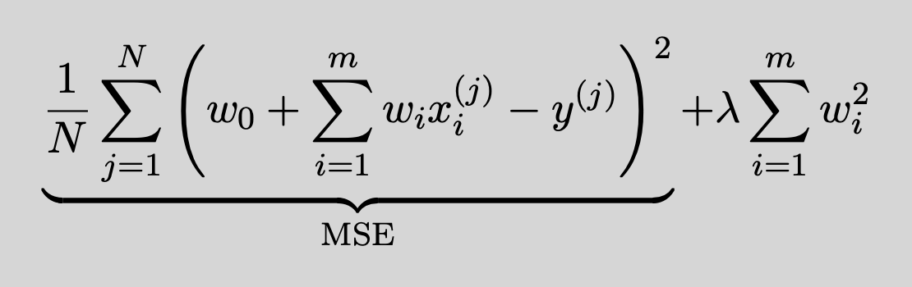
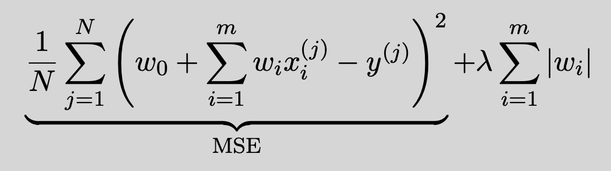
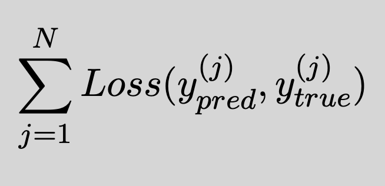
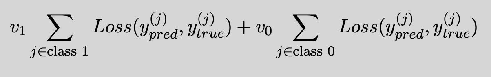

You may complete the following entirely in a Jupyter notebook.
Use the LaTeX interpreter in a markdown cell where needed.

## Problem 1: Regularization

A linear model such as logistic regression or linear regression might
overfit the data when there is a large number of features. One way to
address this issue is to regularize or shrink the contribution of some
of the features by reducing the magnitude of their corresponding
weights or coefficients. By doing so, we can reduce the variance of the
predicted values, and we can enhance the interpretability of the linear
model by determining a smaller subset of the most important
features. This is achieved by adding a penalty or regularization term to
the cost function, which forces the learning algorithm to not only fit
the data but also to keep the weights of the model as small as possible.

### Regularized versions of linear regression

One way to regularize linear regression is to modify the cost
function as follows:



also known as the L2 norm of
the weight vector - is the regularization term or shrinkage penalty.

λ is the regularization hyperparameter that you can use to
control how much you want to regularize the model. Note that it is
important to scale the data before performing regularization.

1. Regularization hyperparameter:
   - What is the difference between a model's parameter and a model's hyperparameter?
   - As we increase λ from 0, how will the training MSE (mean-squared error) change? How will the test MSE change? Sketch the bias-variance trade-off.
   - Suppose you used regularized linear regression and noticed that the training and validation errors are almost equal and high. Should you increase or decrease the regularization hyperparameter λ?

2. Regularizing linear regression using the L2 norm is known as the ridge regression. There is another version of regularized linear regression known as the Lasso regression, defined as follows:



is known as the L1 norm of the weight vector. An important characteristic of the Lasso regression is
that it can force some of the weights to be exactly equal to zero when the hyperparameter λ is high enough. On the other hand, ridge regression shrinks all of the weights toward zero but does not set any of them to zero.

- Load the [California housing dataset](https://scikit-learn.org/stable/modules/generated/sklearn.datasets.fetch_california_housing.html)
- Split the data into 80% for training and 20% for testing using ```[train_test_split](https://scikit-learn.org/stable/modules/generated/sklearn.model_selection.train_test_split.html)```.
- Part 1: Use the [ridge regression](https://scikit-learn.org/stable/modules/generated/sklearn.linear_model.ridge_regression.html?highlight=ridge\%20regression\#) implementation in scikit-learn and fit several ridge regression models to the training data. Use a different λ - (α in scikit-learn) for each of these models (you can try values in ```np.arange(0,MAXIMUM,STEP)``` or ```np.linspace(0,MAXIMUM,STEPS)```. For each fitted model extract its coefficients and compute their norms. How is the norm of the coefficients changing by varying the hyperparameter λ? Choose MAXIMUM so that you see a wide range of coefficient norms; make it large enough so you can see asymptotic performance.  Make sure to [scale the training data](https://scikit-learn.org/stable/modules/generated/sklearn.preprocessing.StandardScaler.html) before fitting each model.
- Part 2: Perform cross validation on the training dataset, to select the best model between:
  * [```LinearRegression```](https://scikit-learn.org/stable/modules/generated/sklearn.linear_model.LinearRegression.html),
  * [```Lasso```](https://scikit-learn.org/stable/modules/generated/sklearn.linear_model.Lasso.html),
  * and [```ridge_regression```](https://scikit-learn.org/stable/modules/generated/sklearn.linear_model.ridge_regression.html?highlight=ridge\%20regression\#).

  For each of the ridge regression and lasso models, try different values for λ (or α in sklearn), and then choose a final model and evaluate it on the test set. Note: to perform cross-validation (5-fold), you can use [```cross_validate```](https://scikit-learn.org/stable/modules/generated/sklearn.model_selection.cross_validate.html?highlight=cross\%20validate\#) and specify the scoring as ```neg_mean_squared_error``` or ```mean_squared_error```.

Logistic regression can be also extended by including a regularization term to the cost
function of logistic regression. The regularization term can be in terms of the L2 norm or L1 norm of the weight vector.

## Problem 2: Class Weighted Algorithm

We've seen that the cost functions used in training the machine models can be written as:



ML models used for classification assume that there is an equal number of samples observed from each class, and that all losses incurred due to misclassification are the same. However, this is not always the case,
as the data might be imbalanced and where the minority class is the class of interest for us.

One way to mitigate the class imbalances is to modify the cost function to the following:



*v₁* and *v₀* are weights assigned to each class, where the *v* hyperparameters are chosen in order to draw the attention of the learning algorithm to the minority class. When the weighted version of the cost function is implemented, we refer to the modified version of the algorithm as the class weighted algorithm or weighted algorithm.

- If class 1 is the minority class, how should *v₁* be chosen with respect to *v₀*?
- Load the [```creditcard.csv```](https://www.kaggle.com/datasets/mlg-ulb/creditcardfraud/data) data.
  -  The last column represents the class label. Check the proportion of each class and comment on the severity of the class imbalance.
  -  Split the data into training and testing (20% for testing).
  -  Process the training set by scaling the features using ```StandardScaler```, scale the testing set in the same way.
  -  Fit two models on the training data: logistic regression and weighted logistic regression (by setting ```class_weight``` to "balanced").
  -  Test the two models on the testing set using the recall score.
